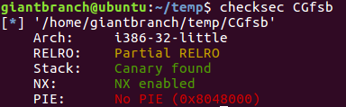

## checksec
   作用: 检查可执行文件的属性.  
   使用方法: `checksec [filename]`  
   示例:  
     
   解析:  
   1. Arch:  
   指示程序是 32 位还是 64 位.  
   1. RELRO:  
      1. Full RELRO
      2. Partial RELRO
   2. Stack:  
   Canary: 这个单词的中文意思是金丝雀, 以前的石油工人经常用金丝雀来判断气体是否有毒. 应用于栈保护上, 则是在初始化一个栈帧时在 ebp 下面放一个随机数, 在函数返回之前检查这个数有没有被修改, 以此来检查是否发生栈溢出.(详情: https://www.cnblogs.com/ttxs69/p/pwn_canary.html)  
   编译时栈保护的控制:  
   `gcc -fno-stack-protector -o test test.c  //禁用栈保护`  
   `gcc -fstack-protector -o test test.c   //启用堆栈保护，不过只为局部变量中含有 char 数组的函数插入保护代码`  
   `gcc -fstack-protector-all -o test test.c //启用堆栈保护，为所有函数插入保护代码`
   4. NX:  
   NX enabled: 代表程序开启不可执行栈功能.  
   gcc 编译器默认开启了 NX 选项, 可以如此强行关闭:
   `gcc -z execstack -o test test.c`  
   (详情见《CTF 特训营》P335).
   5. PIE(ASLR):  
   地址空间分布随机化. (详情见《CTF 特训营》P335)
   