1. `checksec pwn3`  
   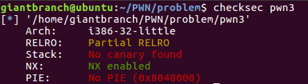<center>图1</center>

2. 运行程序 + 逆向查看代码
   1. 查看 main 函数
   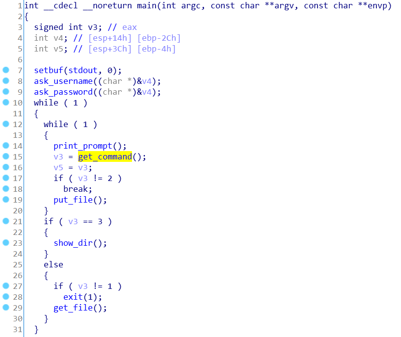<center>图2</center>
   
   2. 查看 ask_username 函数  
   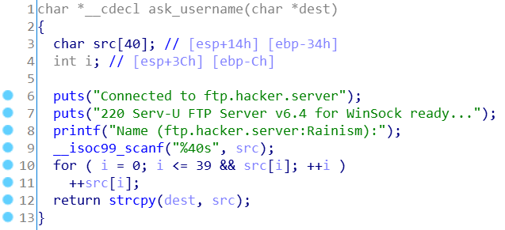<center>图3</center>
   运行程序检验:  
   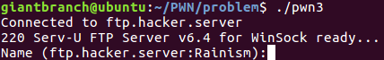<center>图4</center>
   ```
   分析:
   在 "Name (ftp.hacker.server:Rainism):" 后面的输入保存到 src 字符串中, 然后将字符串中的各个元素加 1, 复制到 dest 字符串中. 在此 dest 对应的实参是 v4, v4 后面还会传给 ask_password 函数, 因此, 继续查看 ask_password 函数.
   ```

   3. 查看 ask_password 函数  
   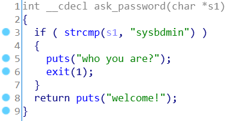<center>图5</center>
   可以看到: 若输入的字符串 s1 不等于 "sysbdmin", 程序就会直接 exit. 再考虑到 ask_username 函数将各个元素都加 1, 所以我们需要在 "Name (ftp.hacker.server:Rainism):" 后面输入 "rxraclhm" 才能绕过这个 exit. 效果如下:  
   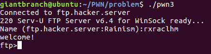<center>图6</center>
   此时刚运行的是 print_prompt 函数:  
   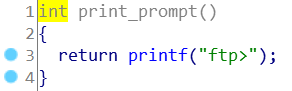<center>图7</center>

   4. 查看 get_command 函数  
   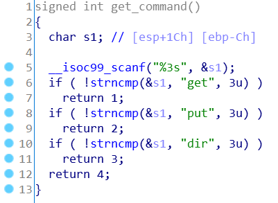<center>图8</center>
   结合图 2 可知: 如果输入的是 "get", 就会进入 get_file 函数; 如果输入的是 "put", 就会进入 put_file 函数; 如果输入的是 "dir", 就会进入 show_dir 函数.

   5. 查看 get_file/put_file/show_dir 函数  
   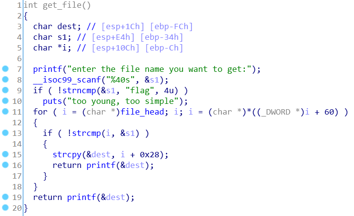<center>图9</center>
   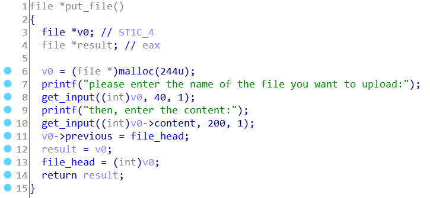<center>图10</center>
   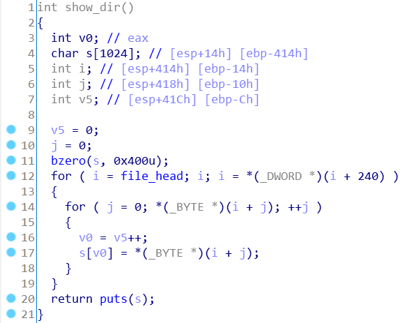<center>图11</center>
   分析源码, 运行程序:
   ```
   程序中定义了一个结构体 file:
   struct file{
      char name[40];
      char content[200];
      int previous;
   };
   file 代表一个文件, 用 previous 将所有文件连成一条链.
   put 要求输入文件名和文件内容, 以此创建一个文件, 并将该文件加入到文件链中;
   get 要求输入文件名, 查找并输出文件链中该文件的内容;
   dir 则按照先入后出的顺序将所有文件的文件名输出出来.
   ```
   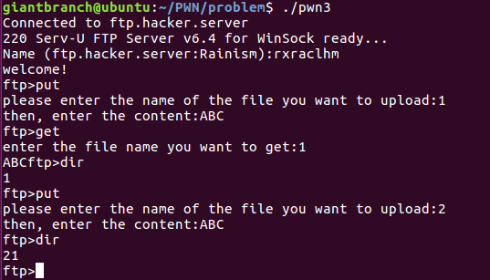<center>图12</center>
   注意到 get_file 中是有格式化字符串漏洞的, 而且 show_dir 中用到了 puts 函数, 因此我们获取 shell 的思路是这样的: 利用格式化字符串漏洞将 puts@got 的内容修改成 system 的地址, 当程序再次执行 `puts("/bin/sh")` 函数的时候, 其实执行的是 `system("/bin/sh")` 函数.

3. PWN it!  
   1. 确定 libc 的版本(利用 gdb-peda 直接查看 __libc_start_main 的地址)  
   `gdb ./pwn3` -> `r` -> ctrl + z -> `print __libc_start_main`
   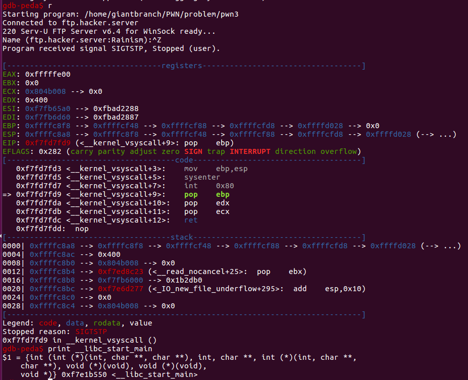<center>图13</center>
   (这里卡住了, `./find __libc_stat_main` 找不到对应的 libc 版本, 不知道哪里出了问题. 在此先采取一种妥协式的做法, 直接用 `print system` 查询.)
   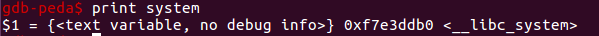<center>图14</center>

   2. 得到 put 函数在 plt 表中的地址
   `objdump -R pwn3`
   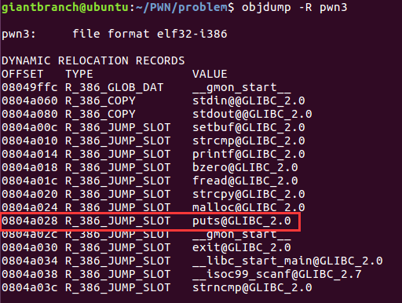<center>图14</center>

   3. 123
4. 123