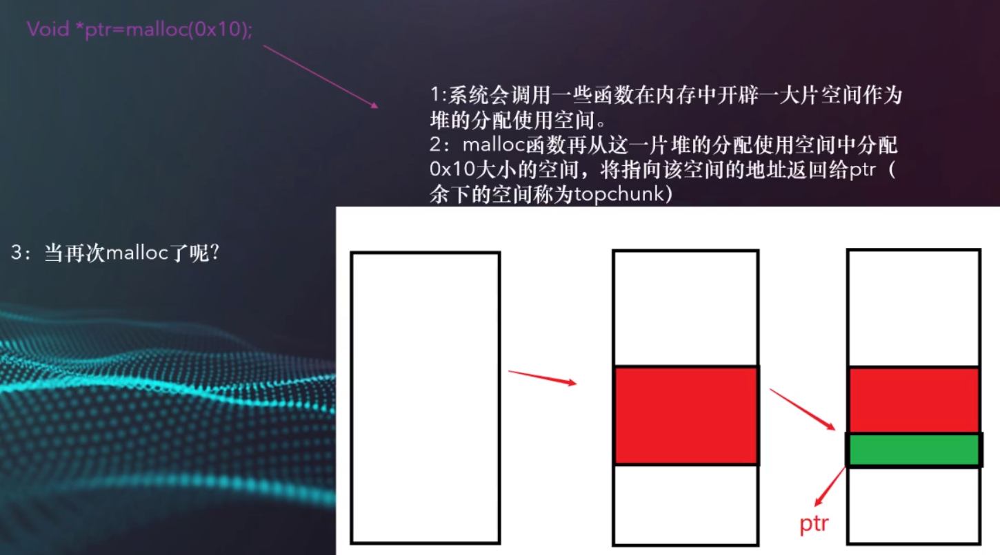
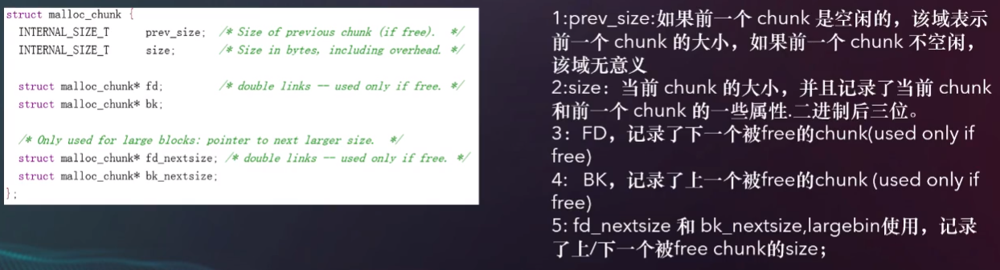
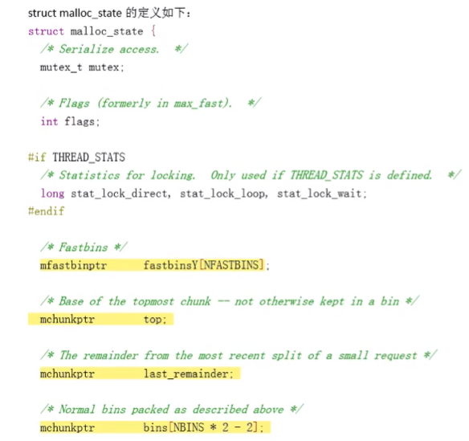
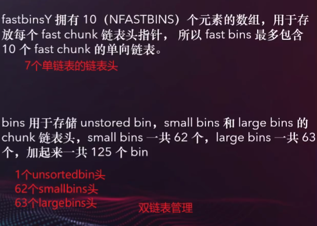
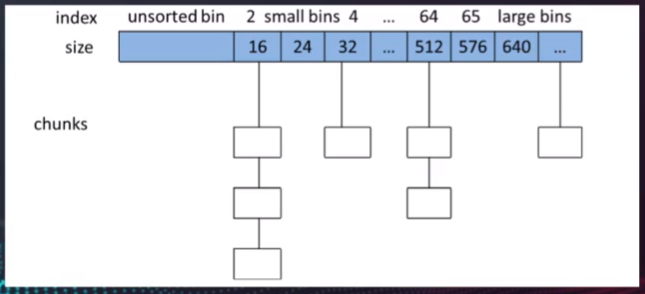

1. 堆的申请  
   首次调用 `void* malloc(size_t size)` 函数时, 系统会分配一片很大的空间, 再从这片空间中分配 size 大小的空间, 返回指向小空间的指针, 而大空间中余下的部分叫做 topchunk. 再次调用 malloc 函数时就可以从 topchunk 中分配. 
   

2. chunk(chunk 就是堆的最小操作单元, 在 C 语言底层 具体实现中就是一个结构体)
   1. chunk 结构体
   
   
   
   2. 123
   
3. 堆的释放
   堆的释放一般用 free 函数实现, free 后 chunk 会被添加到 bins 中进行管理(具体的结构体是 malloc_state). malloc_state 定义如下:  

4. bins  
   Bins(垃圾桶), 用于存放被释放 (free) 的 chunk. 分为: fastbins, smallbins, largebins, unsorted bins. glibc 提供了两个数组: fastbinY(管理 fastbins), bins(管理 small bins, large bins, unsorted bin).   
   bins 整体结构:  
   unsorted bin:  
   small bin:  

5. 123