1. gcc 的文件类型约定规则
   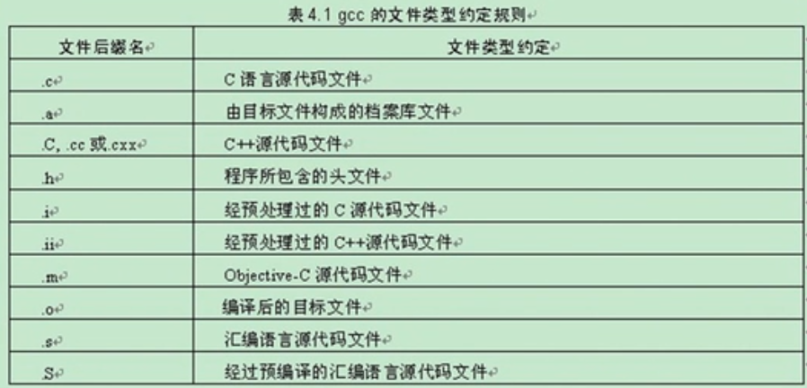

2. gcc 常用选项
   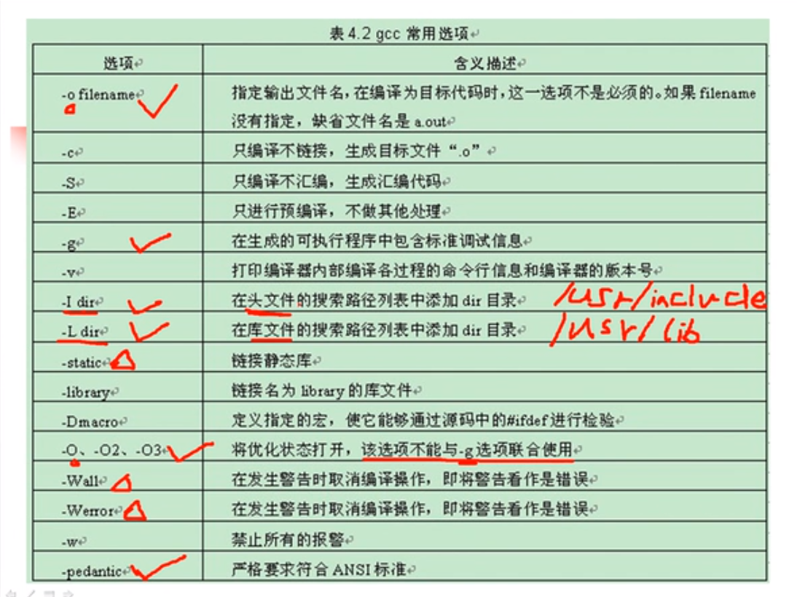

3. gcc 编译
   
   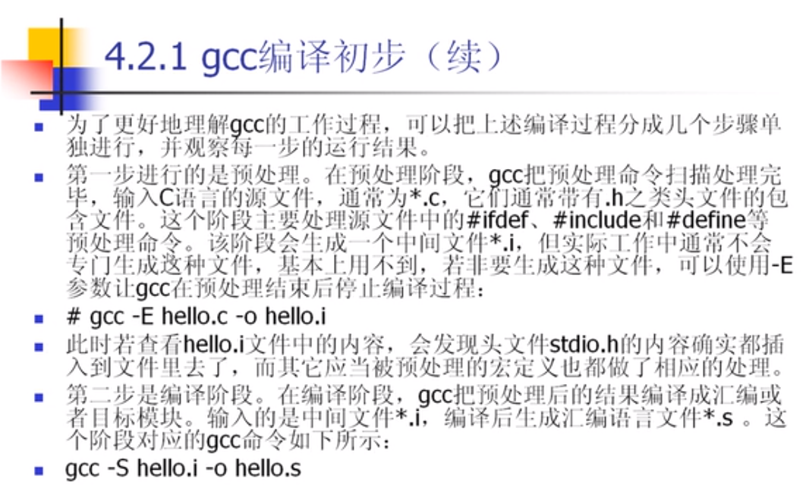
   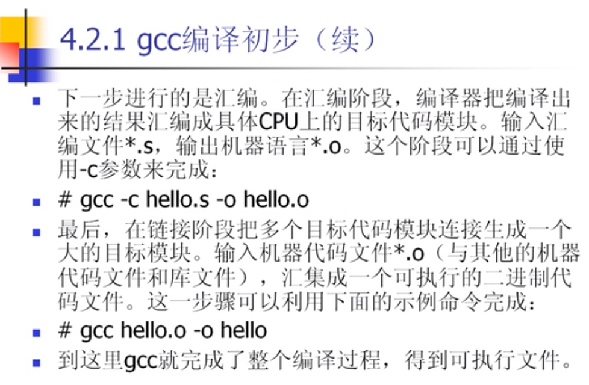

4. gcc 优化
   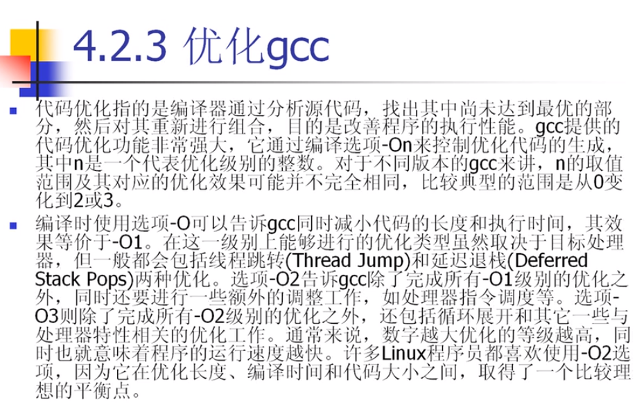

5. 调试选项
   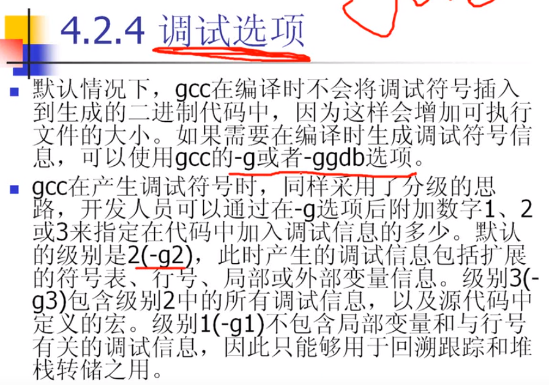
   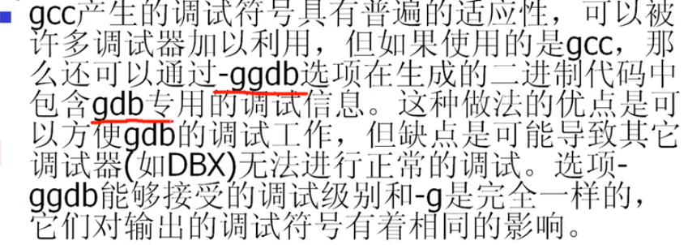

6. gdb
   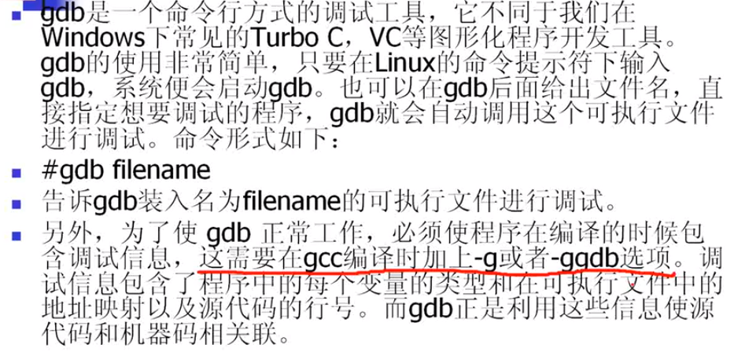

7. gdb 常用指令
   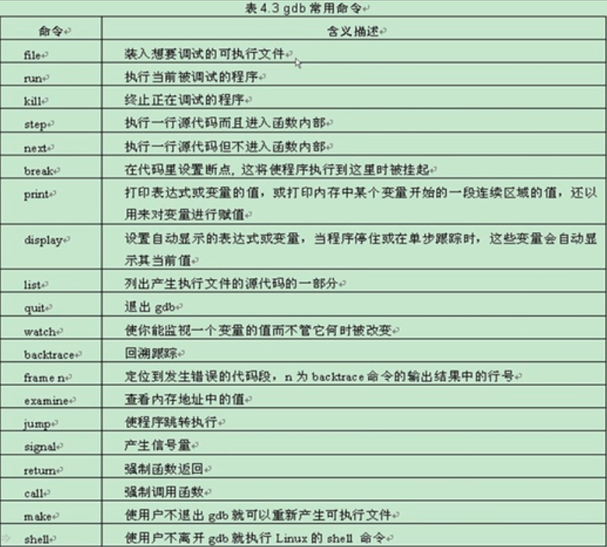
   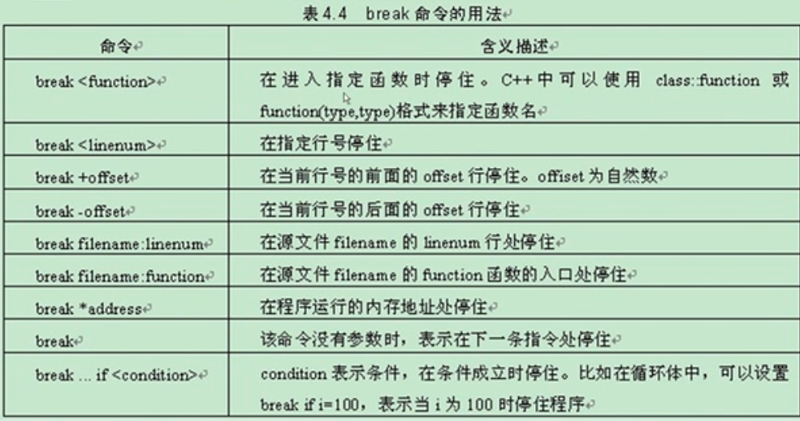
   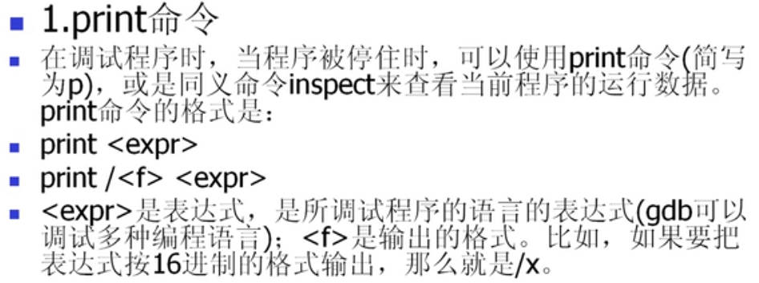
   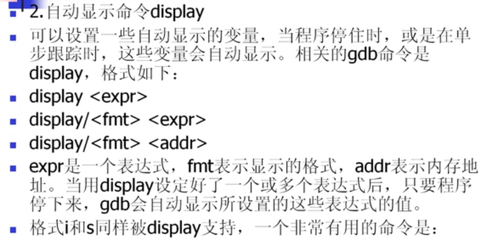
   
   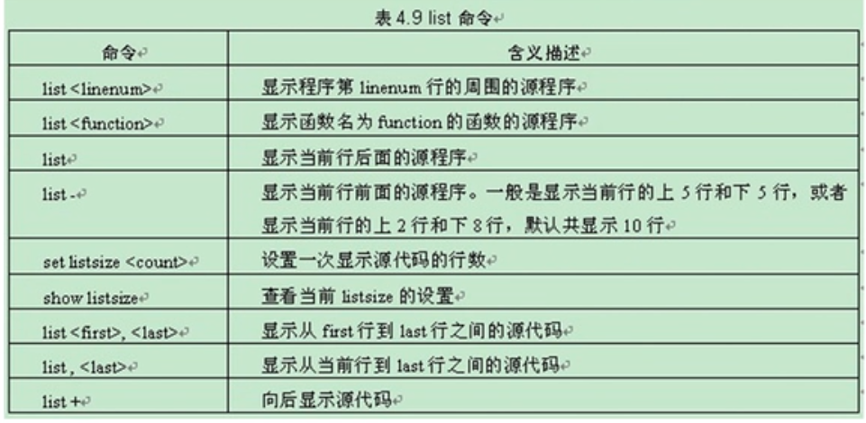
   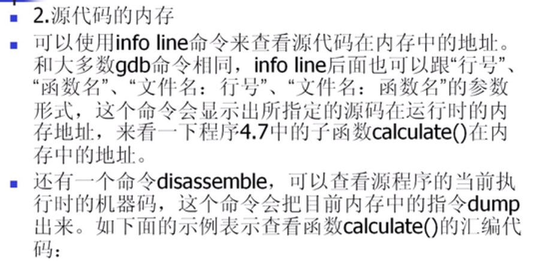
   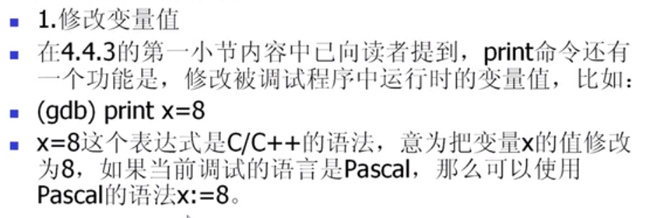
   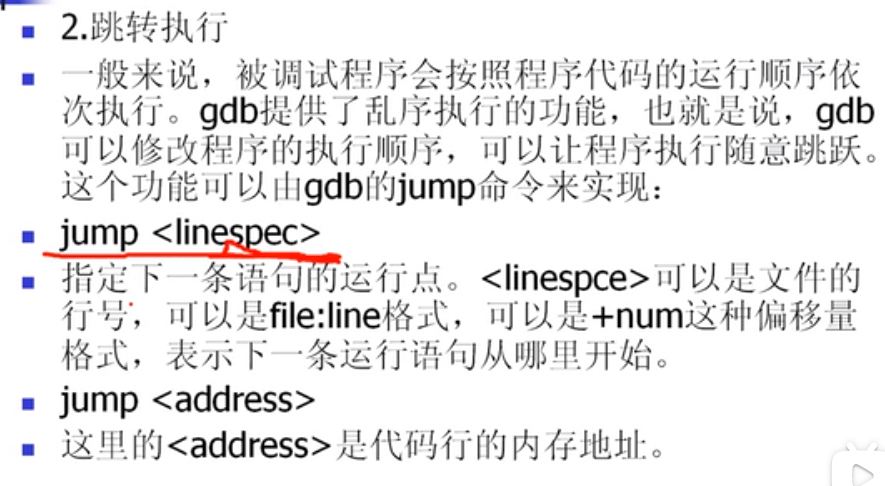
   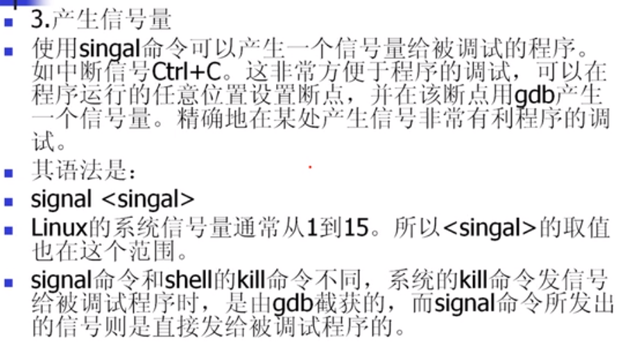
   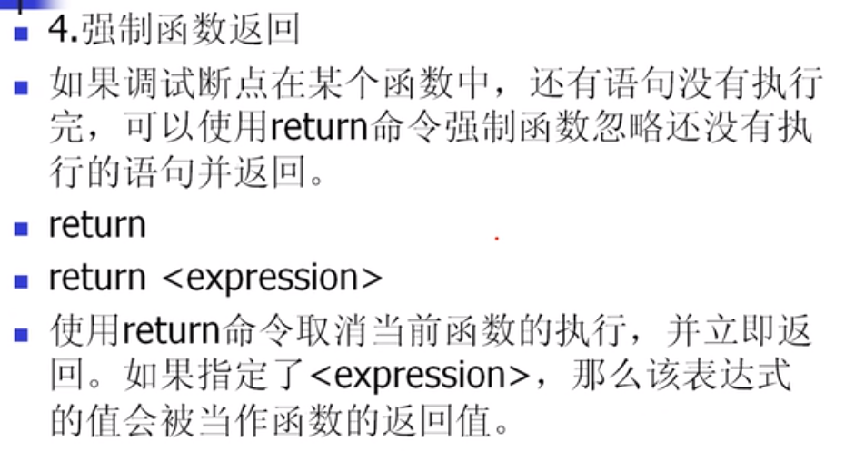
   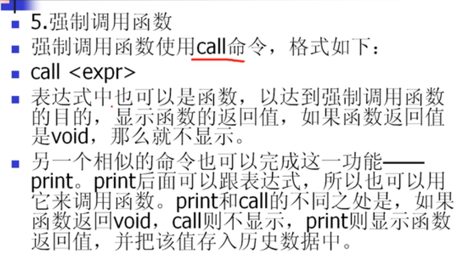

8. gdb debug
   发现错误 -> backtrace -> frame n
9.  123